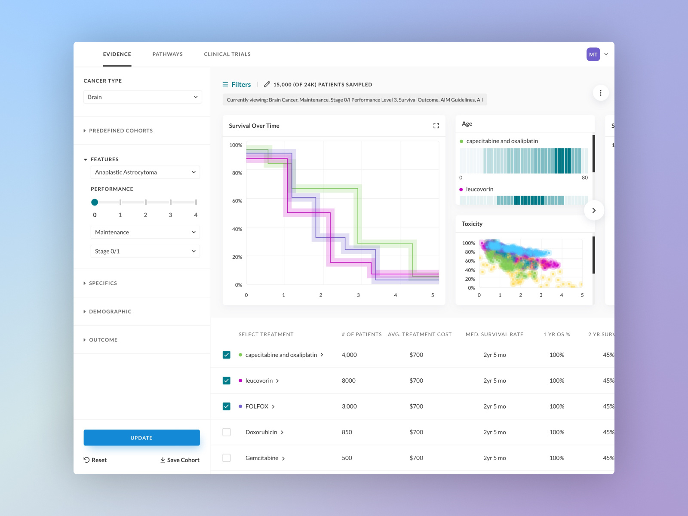
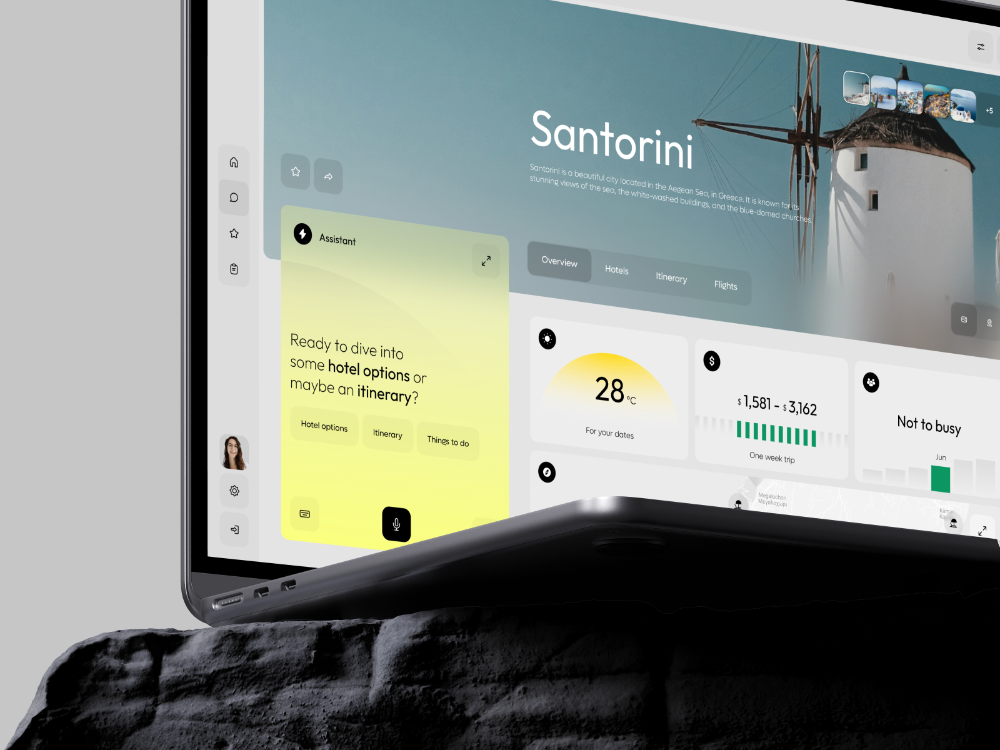
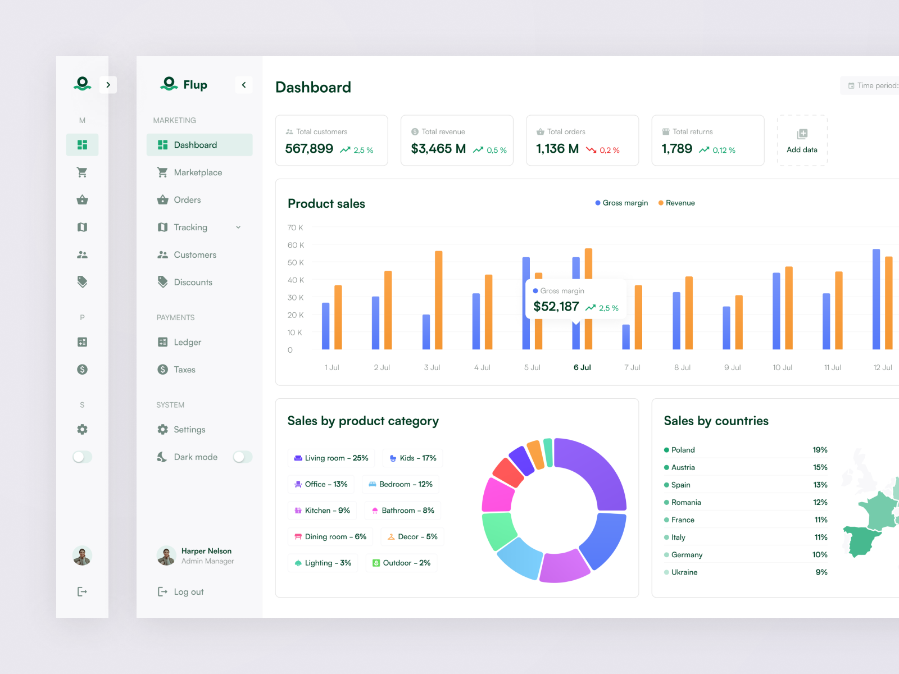
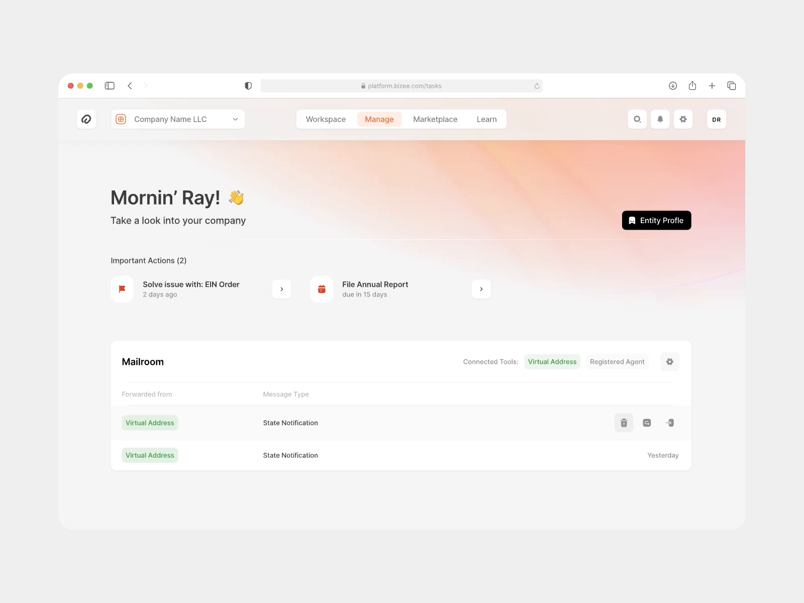

# Design References

Reference and standards companion for design work in this repo. Pair it with `docs/design-standards.md`. Everything here comes from four studied dashboards plus a list of failure modes. Use it to set a bar and to self-audit before shipping.

## The standard

Quality decides whether a client stays or leaves. Before you ship any view, open the project and look at it with the client's eyes. Is it good enough. Does it feel responsive and fast. If the answer is "almost," it is not done.

Design is removing. Every element on screen must earn its place. When you can delete something without hurting the view, it should never have been there.

AI-slop is forbidden. No purple gradients, no system emoji icons, no fake dashboards, no decorative motion for its own sake, no glowing status dots or accent bars. If a reviewer can tell a model made it, redo it.

Creativity beyond these rules is welcome. The rules set a floor, not a ceiling. Be opinionated about messaging, brand, and originality once the floor is met.

## Palette

| Token | Hex | Role |
|---|---|---|
| Main | `#a15936` | Brand. Active states, primary action, one hero element per view. |
| Light white | `#ffebe1` | Canvas. Warm off-white the app floats on. |
| Black | `#121212` | Ink. Headings, body, high-contrast CTA. |

Three hexes are seeds, not the whole system. Build a usable scale from them:

- Tints and shades of Main: step lightness up toward `#ffebe1` for hovers, pills, and pale fills; step it down toward `#121212` for pressed states and dense text on light. Aim for 5 to 7 stops.
- Neutrals: derive mid-grays for secondary labels and metadata by mixing Black into Light white. Keep borders as barely-there hairlines or skip them entirely in favor of whitespace and soft shadow.
- Reserve Main for state and one hero per view. If you need data-viz color, let the data carry saturation and keep the UI chrome near-mono. Check every text pair for contrast before shipping; faint copy fails the standard.

## References

Four studied dashboards. Each entry is what it does well, then the concrete moves to take. Screenshots are in `spec/design/refs/`.

### Oncology Browser Dashboard

`spec/design/refs/oncology-dashboard.png`. Source: https://dribbble.com/shots/22372671-Oncology-Browser-Dashboard-Desktop-UI

A clinical-evidence explorer: left filter rail, top tabs, a charts band, a comparison table. High data density that never feels cramped because whitespace divides, not lines. UI chrome is restrained so the charts carry all the saturation.

Moves to steal:

- Float the whole app shell as a rounded card over a soft tinted canvas. One wrapper, a tinted background, radius and a whisper shadow. Lifts a data app from admin panel to product.
- Tracked-out all-caps micro-labels in mid-gray as the only label style, paired with near-invisible hairlines and whitespace dividers. Structure through type and air, never boxes.
- One saturated hero element per view, everything else desaturated to near-mono. Pull accents out of the UI and put them in the data.

### AI Travel Web Dashboard

`spec/design/refs/ai-travel-dashboard.png`. Source: https://dribbble.com/shots/24635204-AI-Travel-Web-Dashboard

A low-density, high-whitespace layout. Narrow icon rail, a full-bleed photographic hero with text overprinted, and roomy stat tiles. Neutral canvas plus black micro-icons plus one electric accent surface. Restrained, not rainbow.

Moves to steal:

- Spend the whole color budget on one saturated surface on an otherwise neutral canvas, so the primary action glows without any glow effect or accent bar.
- Photographic full-bleed hero with the title overprinted on the image and an oversized light-weight headline carrying the type hierarchy alone. Reads editorial.
- One number per card: small solid icon badge, big bold value, tiny gray label, minimal inline chart. Floating white cards on warm gray, shadow-only separation, no borders.

### Flup Furniture Admin

`spec/design/refs/flup-furniture-admin.png`. Source: https://dribbble.com/shots/18895539-Modern-Admin-Dashboard-UI-Design-for-Flup-Furniture-App-Website

A triple-column shell on a soft canvas. A thin icon rail beside a collapsible labeled nav, then borderless KPI cards. Medium-low density, intentionally airy. One muted brand color carries all state; saturation is quarantined to the charts.

Moves to steal:

- Dual sidebar: a persistent thin icon rail beside a collapsible labeled panel gives fast muscle-memory nav plus full clarity, and collapsing the labels reclaims width without losing navigation.
- Numbers-as-hero KPI cards: borderless cards on a tinted canvas, one big figure with a tiny colored delta. A dashed "add data" slot makes the row feel customizable.
- Disciplined color: a single brand color handles active pill and positive trend; everything else stays neutral so the data still pops.

### Riotters Dashboard Drafts

`spec/design/refs/riotters-dashboard-drafts.png`. Source: https://dribbble.com/shots/25899580-Dashboard-Drafts

A calm SaaS dashboard, single column, no sidebar. A personable oversized greeting hero, an important-actions row, one wide table. Deliberately low density: it shows little and makes each element feel important. Warm off-white canvas, pure-white floating cards, near-zero borders.

Moves to steal:

- Warm off-white canvas plus pure-white floating cards with near-zero borders and a whisper shadow. Drops visual noise and reads expensive immediately.
- Exactly two semantic accents on top of neutral: one for primary and active, one for status. One lone high-contrast pill proves how a single loud element directs the eye when the rest is quiet.
- Open the view with human tone and the one or two things that need attention, not a wall of metrics. Hierarchy by weight, size, and color, not rules or boxes.

## Vibe-coding self-audit

Run this checklist before shipping. Each line is a do and a don't. A landing page or app view is a customer-acquisition surface; QA every interaction yourself, you are the editor now.

| Don't | Do |
|---|---|
| Purple or pink default gradients | Use the brand palette above, fed in deliberately |
| A decorative line or SVG that tracks the scroll | Cut it unless it genuinely reinforces the product |
| Hover effects that fade or recede nav items | On hover, make it pop one shade brighter, never vanish |
| Hide essential info or actions behind hover | Keep essential functionality always visible; hover is delight only, and absent on mobile |
| Low-contrast, too-light body text | Raise contrast until every line is legible |
| System emoji as icons | Original, on-brand icons |
| Accent color that clashes with the logo | Pick colors that work with the brand, here Main `#a15936` |
| Company name styled as the headline, value prop below the fold | H1 answers what it is, who it is for, why care, plus a CTA, above the fold |
| A fourth or fifth type style and invented in-between labels | Collapse to a tight set of styles; delete redundant labels |
| Scroll-jacking or hijacked native scroll | Keep native browser scrolling |
| Fade-in-on-scroll sections, especially timed | Render content in final state as you reach it |
| A CTA button that chases the cursor | Static, clickable buttons |
| Buttons that reshuffle style or position, ambiguous click targets | Consistent button styling, one clear target, no head-fake hand cursors |
| Meteors, cursor trails, gratuitous motion | Keep only motion that reinforces the product |
| Blurry or low-res hero assets, mismatched poster and video | High-res assets, consistent hero media |
| Sections that look like different sites | One visual system top to bottom |
| Nav menus with gaps where items disappear between states | Smooth transitions, no popping |
| Two stacked headers during the sticky transition | Transition one header into the other |
| Top nav unreadable over a video or dynamic background | Guarantee menu legibility against whatever sits behind it |
| Full-height empty hero with vague stats and "scroll down" | Break the full-height lock so the next section peeks up; put specific content in |
| Fake templated dashboard with red/yellow/green/blue callouts | Show real product UI or design something original |
| Default 3x2 bento grid of icon plus heading plus text | Use sparingly and make it yours |
| Ship one-shot output unchecked | QA every selection state, click, and transition before shipping |
